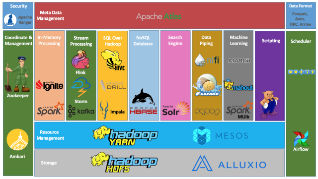

# Projektdokumentation
## Stille Wasser sind tief - eine Reise zum Delta Lake von Cenk und Alexander
## Datenplattformarchitekturen & MLOps

von Alexander Ciuffreda (Matrikel-Nr.: 37262) und Cenk Yagkan (Matrikel-Nr.: 36806)

## 1. Projektvorstellung
Im Rahmen des Projekts wird mit Hilfe von Open-Source-Software eine **Datenplattformarchitektur** für die Realisierung unterschiedlicher Machine Learning Anwendungsfälle konzipiert und implementiert. In der Architektur werden für eine möglichst umfassende Automatisierung des Machine Learning Lifecycles Komponenten der Disziplin **Machine Learning Operations** (MLOps) berücksichtigt.

## 2. Usecase und Datensatz
Im Rahmen des Projektes soll ein Machine Learning Modell entwickelt werden, dass in der Lage ist, die letzten 20 Zyklen einer Flugzeugturbine zu identifizieren. Hierbei wird der Prognostik- und Gesundheitsmanagement-Datensatz „PHM08“ von der NASA verwendet. Im Datensatz enthalten sind Messungen von verschiedenen Temperatur-, Drehzahl- und Drucksensoren, die für das Düsentriebwerk typisch sind. Alle Triebwerke sind vom gleichen Typ, aber jedes Triebwerk beginnt mit unterschiedlichem Anfangsverschleiß und Variationen im Herstellungsprozess, die dem Benutzer unbekannt sind. Es gibt drei optionale Einstellungen, mit denen die Leistung jeder Maschine verändert werden kann. Jeder Motor verfügt 24 Sensoren, die verschiedene Messungen zum Zustand des Motors während der Laufzeit vornehmen. Im Laufe der Zeit entwickelt jedes Triebwerk einen Fehler, der anhand der Sensormesswerte erkennbar ist. Die Messungen erfolgen solange bis das jeweilige Triebwerk aufgrund eines Defekts nicht mehr gestartet werden kann. Für jedes Triebwerk wird so die maximale Anzahl der Zyklen bis zum Ausfall ermittelt, wobei ein Zyklus eine nicht näher definierte Zeiteinheit repräsentiert.

**Problemdefinition**
Mit Hilfe eines Klassifikationsmodells sollen die letzten 20 Zyklen einer Flugzeugturbine auf Basis von Sensormessungen erkannt werden.

## 3. Implementierung der Lakehouse Architektur

### 3.1 Entscheidung - Hadoop Ökosystem vs Delta Lake
Bevor wir uns dazu entschieden haben, die Lakehouse Architektur mit Hilfe des Open-Source-Projektes “Delta Lake” zu errichten, haben wir uns zuvor genauer mit dem Hadoop Ökosystem beschäftigt. Hierbei beschäftigten wir uns mit Hadoop Distributed File System (HDFS) und mit Apache Atlas. Für unsere Lakehouse Architektur hatten wir den Grundgedanken, dass wir HDFS als verteiltes Dateisystem verwenden, sodass auch große Datenmengen verarbeitet werden können. Gerade in unserem Usecase, indem Unmengen an Sensordaten zur Verfügung stehen, wäre HDFS eine solide Basis für unsere Plattformarchitektur. Um ein Datenkatalog von den Sensor-Datensätzen zu erstellen bzw. ein Metadata Management on top des HDFS zu errichten, hatten wir die Idee hierfür Apache Atlas zu verwenden. In der Praxis zeigte sich jedoch, dass es nicht so einfach ist mit einzelnen Apache Lösungen eine Lakehouse Architektur zu errichten. Deshalb entschieden wir schlussendlich für Delta Lake.

**Hadoop Ökosystem**

Quelle: https://dzone.com/articles/example-of-etl-application-using-apache-spark-and

### 3.2 Vorgehensweise für die Implementierung des Delta Lakes
Im Verlauf des Projektes hat sich gezeigt, dass sich Delta Lake nicht nur ideal für die Lakehouse Architektur eignet, sondern auch einige Vorteile mit sich bringt wie die ACID-Transaktionen oder das Streaming- und Batchdaten innerhalb einer Architektur verarbeitet und gespeichert werden können. Für die Umsetzung des Delta Lakes orientierten wir uns an der [offiziellen Dokumentation von Delta Lake](https://docs.delta.io/latest/delta-intro.html). Hierbei installierten wir im ersten Schritt PySpark und anschließend das Delta Lake Paket. Darauffolgend experimentierten wir viel mit Delta Tables, um ein besseres Verständnis zu erhalten. Neben dem Erstellen, Lesen und Updaten der Tabellen lernten wir auch, dass man mit „time travel“ unterschiedliche Versionen der Tabellen abfragen kann. Nachdem wir uns sicher gefühlt haben, beschäftigen wir uns mit den Sensordaten. Nach der Experimentationsphase haben wir den Datensatz von der NASA mittels spark.read.csv eingelesen und anschließend in Delta Tables umgewandelt und in den „Bronzeordner“ abgelegt.

Mit der Unterteilung der Daten in unterschiedliche Qualitätsstufen verfolgten wir den Ansatz der Multi-Hop Architektur. Hierbei stellen die Rohdaten im Bronzeordner die „single source of truth“ dar, von der alles ausgeht. In weiteren Schritten wurden die Daten für die Modellierung aufbereitet. Die durchgeführten Aufbereitungsschritte werden in dem nächsten Kapitel näher erläutert. Die aufbereiteten Daten wurden dann anschließend in den Silverordner geladen. Von dort aus stehen die Daten für das Training zur Verfügung. Auf einen Goldordner haben wir in unserem Usecase verzichtet, da die Trennung zwischen Rohdaten und Trainingsdaten für unsere Zwecke genügte.

Die abgespeicherten Daten stehen im Delta Lake als Parquetfiles zur Verfügung. Dies bringt mehrere Vorteile mit sich. Zu einem wird durch die Abspeicherung der Daten in Parquetfiles weniger Speicherplatz benötigt und zum anderen können die Daten auch effizienter verarbeitet werden.

### 3.3 Data Preparation
Damit die Daten später für die Modellierung auch verwendet werden können, müssen die Daten zunächst aufbereitet werden. Hierfür waren mehrere Schritte notwendig:

Den vollständigen Code hierfür, findet man unter unserem Github repository:
https://github.com/alexanderciuffreda/mlops/blob/main/dataset/data-preparation.ipynb

## 4. MLOps
Für die Umsetzung von MLOps stehen zahlreiche unterschiedliche Tools zur Verfügung. Im Rahmen dieses Projektes haben wir uns auf Kubeflow und Airflow fokussiert. Auf diese zwei Orchestratoren wird im Folgenden genauer eingegangen.

### 4.1 Kubeflow
Von den in der Vorlesung vorgestellten Software Frameworks für Machine Learning Operations erschien uns Kubeflow aufgrund des Container basierten Deployments und der ansprechenden vielfältigen Funktionalitäten inklusive zentralem Dashboard für die Administration am besten für unser Projekt.
Durch die Container basierte Lösung mit Kubernetes, erhofften wir uns eine niedrige Eintrittsbarriere, da in der Theorie der Kubeflow Container auf jedem System mit entsprechenden Hypervisor ausführbar und verwendbar sein müsste.
Auf der offiziellen Seite von Kubeflow stehen dazu vielfältige Möglichkeiten zur Auswahl:

So sind neben den Software as a Service Produkten auf den gängigen Cloud Plattformen auch Versionen für Business Linux Distributionen verfügbar, die sich jedoch nicht an private Anwender zur Prototypischen Umsetzung richten, da die Kosten für eine Kubeflow Installation zum Beispiel auf Google Cloud Platform (GCP) sehr hoch sind.
Glücklicherweise wird jedoch auch Arrikto MiniKF oder das MicroK8s Kubeflow von Canonical angeboten, welches einfach auf beliebigen Endgeräten installiert werden kann.
Wie in der Vorlesung empfohlen, verwendeten wir als erstes die Distribution von Arrikto und verwendeten dazu das von Herr Prof. Dr. Kirenz erstellte Tutorial.
Leider mussten wir feststellen, dass der Hypervisor Vagrant noch nicht für ARM64 basierte Prozessoren verfügbar war und deshalb auf den Apple Computern mit M1 Architektur nicht lauffähig war. Auf einem Intel Mac konnte Vagrant problemlos installiert werden und das MiniKF Image konnte ebenfalls gebootet werden.
Über das Kubeflow Dashboard konnten wir so eine erste Pipeline basierend auf dem Taxi Trips Datensatz anlegen und starten.
Doch dann mussten wir den nächsten Wermutstropfen hinnehmen: Die Kombination aus VirtualBox (Vagrant) und Kubeflow welches sehr Hardware-Hungrig ist war zu viel für das MacBook mit nur 16 GB Arbeitsspeicher. Die Pipeline konnte nicht erfolgreich ausgeführt werden und wurde während der Ausführung aufgrund von Speicherproblemen terminiert.

Glücklicherweise wurde uns von Google ein Guthaben für die GCP zur Verfügung gestellt, weswegen wir als nächsten Schritt versuchten Vagrant und MiniKF auf einem Ubuntu Server in der Google Cloud zu installieren. Der Vorteil dabei: Nichts geht in der Cloud besser als Skalieren, so verfügten wir quasi über unendliche Hardware Ressourcen (solange das Guthaben dafür ausreicht). Leider mussten wir auch hier schnell feststellen, dass Hypervisor auf Hypervisor eine schlechte Idee ist: Da die Ubuntu Server bereits virtualisiert sind kann (im Fall von GCP) kein weiterer Virtualisierungsdienst auf dem Virtualisierungsdienst installiert werden. MiniKF mit Vagrant auf der GCP war also auch nicht möglich.
Wir gingen zur nächsten Option über: Der neue Hoffnungsträger war das MicroK8s Kubeflow Add-on.
Wie “Add-On” schon vermuten lässt, handelt es sich um eine Erweiterung zum “K8s” Kubernetes Cluster. “K8s” ist die Abkürzung von Kubernetes: Zwischen dem K und dem s werden die acht Buchstaben “ubernete” mit der Zahl “8” zusammengefasst. So ergibt sich die Abkürzung “K8s” für Kubernetes.
Wir erstellen einen Ubuntu Server in der Google Cloud und installierten K8s con Canonical.
Dieser Prozess verlief reibungslos und bestand lediglich daraus über den Paketmanager “snap” das paket “microk8s” zu installieren. Optional konnte noch eine Version und ein Build spezifiziert werden.
Nach der Installation lief (nach ein paar Minuten Wartezeit) auf dem Server ein Kubernetes Cluster und das Kubeflow Addon konnte aktiviert werden. Dies geschah über den einfachen Befehl “microk8s enable kubeflow”. Der Deployment Prozess dauerte je nach Hardware Ausstattung des Servers 15-20 Minuten. Meistens verwendeten wir Instanzen mit 6vCPUs 20 GB Arbeitsspeicher und 100 GB SSD. Wenn alles installiert war konnte dann der Traffic auf localhost auf dem eigenen Computer via SSH Portweiterleitung und Socks Proxy an den Kubernetes Cluster in der Cloud weitergeleitet werden und so auf das Kubeflow Dashboard zugegriffen werden.

Die Inhalte des in der Vorlesung vorgestellten Kubeflow Tutorials basierten auf der Erstellung einer Pipeline in einem Jupyter Notebook bei dem das Addon “Kale” installiert war. Wir mussten jedoch feststellen, dass der Reiter über den das Jupyter Notebook in Kubeflow aufgerufen werden konnte nicht funktionierte.
Wir machten uns also auf die Fehlersuche. Wir hatten keinerlei Erfahrung mit Kubernetes Clustern, für uns war diese Technologie Neuland. Nach Recherche des Fehlers stießen wir auf ein Issue welches bereits im Kubeflow Github geöffnet war (https://github.com/kubeflow/kubeflow/issues/6141) das Problem war also bekannt, jedoch war noch keine Lösung hinterlegt. Nach weiterem Suchen stießen wir auf einen weiteren Eintrag der diesen Fehler erwähnte, dieses mal auf der Canonical Homepage, hier war jedoch auch keine Lösung angegeben. Nach längerem probieren und lesen von ähnlichen Problemen konnten wir eine Lösung finden, dazu war jedoch viel Hintergrundwissen über Kubernetes und Kubeflow notwendig. Wir lernten, dass Kubernetes Applikationen via “Pods” deployed werden. Für diese Pods existiert ein eigenes Ökosystem, man kann eigene Pods kreieren, es gibt einen Store von dem Pods heruntergeladen können und verschiedenste Community Mitglieder tragen zur Entwicklung und Weiterentwicklung bei. Kubeflow ist ein Bündel aus verschiedensten Applikationen - also Pods - die zusammen jeweils einen Bestandteil von Kubeflow abbilden. Diese Modularisierungs-Architektur von Kubeflow adressiert mehrere herausforderungen im ML Umfeld: Die Softwareportabilität (“Portability”), die Skalierbarkeit und die “Composability” der ML Systeme. Das Systementwurfsprinzip Composability lässt sich gut anhand von Lego Klemmbausteinen erklären: Jeder Lego Stein kann mit einem anderen Kombiniert werden und kann dadurch ein komplexes Bauwerk bilden, beispielsweise ein Schaufelbagger oder ein Bugatti Veyron. Genau so können mit den Pods in einem Kubernetes Cluster durch Kombinationen von verschiedenen Applikationen komplexe Systeme entstehen. Die Applikationen in den Pods sind so arrangiert, dass Sie untereinander Kommunizieren und ganz einfach gesagt “Inputs” und “Outputs” in Form von Daten austauschen. Funktioniert eine Applikation nicht mehr, kann Sie einfach erneut deployed werden während alle anderen Applikationen in Ihren Pods ungestört weiter funktionieren können ohne, dass gleich das ganze System ausfällt.
Skalierbarkeit ist durch den Kubernetes Cluster ebenfalls gegeben, sowohl vertikal durch Anpassung der zur Verfügung stehenden Ressourcen für den Cluster oder die Pods, als auch horizontal durch Erhöhung der Anzahl von Pods.
Das Problematische Juypter Notebook welches nicht funktionierte war also ein defekter Legostein und eine eindrucksvolle Demonstration der Vorteile dieser Architektur. Obwohl der Jupyter Hub Pod nicht funktionierte, funktionierte alles andere uneingeschränkt: wir konnten den Webserver Server über das Ingress Gateway erreichen und uns mit dem Dex Authentifizierungsdienst anmelden um auf das Kubeflow Dashboard zu kommen. Zur Lösung unseres Problems entfernten wir den fehlerhaften Jupyter Hub Pod und deployten aus dem Store einfach einen neuen. Sobald der Pod den Status “up” hatte, konnten wir auf den Jupyter Hub Reiter im Kubeflow Dashboard zugreifen. Wir ergänzten das Issue auf unserem MLOps Project Board welches mit dem offiziellen Issue aus den Kubeflow Repository verbunden war. Dies blieb nicht unentdeckt und so wurde im Kubeflow Repo von der Community auf unser gelöstes Issue verwiesen (https://github.com/kubeflow/kubeflow/issues/6141#issuecomment-963487827).

Nachdem Jupyter Hub funktionierte waren wir einen Schritt weiter. Wir erstellten ein Notebook und mussten leider feststellen, dass das Kale Addon nicht vorhanden war. Die Notebooks im Jupyter Hub waren Docker Container, also ein Docker Container auf einem Kubernetes Pod. Nachdem die Versuche mit bestehendem Wissen über lokale Notebooks und deren Addon Installationen scheiterten, kamen wir auf die Idee einfach selbst ein Docker Container zu erstellen mit dem Jupyter Book wo wir das Addon bereits installiert hatten. Wir holten uns also aus dem Kale Repository auf Github die nötigen Daten und erstellen mit Docker ein Image, welches wir in unser DockerHub Repository hochluden. Anschließend konnten wir unser eigens erstelltes Kale Jupyter Notebook von dort aus durch Angabe der URL zum DockerHub Repository starten.

Es funktionierte und wir waren wirklich begeistert dem Problem auf Augenhöhe begegnet zu sein und es so gelöst zu haben. Ab und zu erhielten wir jedoch beim Starten des Notebooks einen Zertifikatsfehler, welchen wir nur durch komplettes neu aufsetzen des Kubernetes Clusters “lösen” konnten (https://github.com/kubernetes/kubernetes/issues/43924). Außerdem trat unregelmäßig der Fehler auf, dass die Dex Authentifizierung nicht funktionierte und man sich nicht mehr am Dashboard anmelden konnte. Wir konnten diesen Fehler ebenfalls nur durch löschen des Servers und neu Aufsetzen des Kubernetes Clusters beheben. Nachdem das Kale Addon auf dem Jupyter Notebook lauffähig war, machten wir uns endlich daran die Tutorial Pipeline umzusetzen. Es kam wie es kommen musste: Die Pipeline aus dem Jupyter Book konnte nicht in Kubeflow Pipelines importiert werden, das es einen Fehler beim Zugriff auf die Experimente gab (https://github.com/alexanderciuffreda/mlops/issues/7). Wir fanden hierzu nach längerer Recherche keine Lösung und drangen tief in Kubernetes spezifische Probleme bezüglich Namespaces und Identitätsverwaltung vor die für uns Anfänger im Kubernetes Bereich zu komplex waren um Sie im Rahmen dieses MLOps Projektes zu erschließen. Wir probierten es also wieder mit dem neu aufsetzen des gesamten Clusters.

Da wir in der Cloud die Möglichkeit hatten Images von unseren Servern zu erstellen sahen wir die Chance das langwierige deployment zu vereinfachen. Leider traten beim wiederherstellen von zuvor gespeicherten VM Images Zertifikatsfehler bei der Authentifizierung auf oder es wurde eine ungültige Client ID zurückgegeben (https://github.com/alexanderciuffreda/mlops/issues/8), sodass wir die Mühe in kauf nehmen mussten alles immer wieder händisch zu deployen.
Wir versuchten beim deployment des Kubernetes Clusters nun verschiedene Methoden. Wir kombinierten verschiedene Builds und Versionen des Kubernetes Clusters mit verschiedenen Versionen des Kubeflow Add-Ons und hofften so eine Kombination zu finden, mit der alles reibungslos funktionierte. Wir variierten auch in der Abfolge der Befehle zur Aktivierung der einzelnen Dienste wie zum Beispiel DNS oder Storage und deployten unterschiedliche Versionen der benötigten Pods manuell auf dem Kubernetes Cluster.
Dieser gesamte Prozess war nicht von Erfolgserlebnissen geprägt und sehr Aufwendig, die Kubeflow Cluster waren sehr Rechenintensiv was uns Geld kostete und das deployment zog sich ebenfalls in die Länge. Wir sahen ein, dass dieser Ansatz vielleicht einfach nicht der richtige Weg unter dieses Umständen war und suchten andere Alternativen. Diese fanden wir in Tensorflow TFX in Kombination mit Apache Airflow.

### 4.2 Airflow + TFX
**Probleme bei der Erstellung der Umgebung**
**1. Versuch:**
Um Apache Airflow mit Tensorflow TFX zu nutzen, war es im ersten Schritt notwendig beide Komponenten in einer Umgebung zu installieren. Hierfür folgten wir dem offiziellen Tutorial von Tensorflow, um die Umgebung aufzusetzen -> https://www.tensorflow.org/tfx/tutorials/tfx/airflow_workshop?hl=en

Hierbei war jedoch das Problem, dass beim Aufsetzen der Umgebung mehrere Fehler entstanden sind. Ein Grund hierfür könnte sein, dass das Setup Skript (setup_demo.sh) nicht mehr auf dem aktuellen Stand war. Das Hauptproblem war es vor allem, dass keine Version gefunden werden konnte, die die Anforderungen erfüllte:

ERROR: Could not find a version that satisfies the requirement pyarrow==0.15.0 (from versions: 0.9.0, 0.10.0, 0.11.0, 0.11.1, 0.12.0, 0.12.1, 0.13.0, 0.14.0, 0.15.1, 0.16.0, 0.17.0, 0.17.1, 1.0.0, 1.0.1, 2.0.0, 3.0.0, 4.0.0, 4.0.1, 5.0.0)
ERROR: No matching distribution found for pyarrow==0.15.0

Building wheels for collected packages: fastavro, pyarrow
Building wheel for fastavro (setup.py) ... error

ERROR: Could not find a version that satisfies the requirement ml-metadata<0.22,>=0.21.2 (from tfx) (from versions: 0.12.0.dev0, 0.13.0.dev0, 0.13.1.dev0, 0.24.0, 0.25.0, 0.25.1, 0.26.0, 0.27.0, 0.28.0, 0.29.0, 0.30.0, 1.0.0, 1.1.0, 1.2.0, 1.3.0)
ERROR: No matching distribution found for ml-metadata<0.22,>=0.21.2

Aus dem Setup Skript ging hervor, dass
- apache-airflow==1.10.9
- tfx==0.21.1
und weitere Packages installiert wurden.

**2. Versuch:**
Nach den Fehlermeldungen haben wir dann versucht, die richtige Version herauszufinden, indem wir mit „pip install“ unterschiedliche Versionen getestet haben. Leider ohne Erfolg.
So haben wir uns dazu entschieden nach einem ähnlichen Tutorial zu suchen und wurde sogar fündig. -> https://github.com/tensorflow/tfx/tree/master/tfx/examples/chicago_taxi_pipeline

Auch mit diesem Tutorial war es leider nicht möglich die Umgebung aufzusetzen. Da es ebenfalls Unstimmigkeiten hinsichtlich der Package-Versionen gab. Hierbei wurde versucht folgende Packages zu installieren:
- pip install apache-airflow==1.10.9
- pip install -U tfx[examples]

**3. Versuch**
Dann kam uns noch die Idee, dass es vielleicht an den unterschiedlichen Python Versionen liegen könnte, so haben wir auch versucht mit Python 3.7, 3.8 und 3.9 beide Packages in einer Umgebung zu installieren. Leider ebenfalls ohne Erfolg, jedoch gab es deutlich weniger Fehler. Hierbei installierte ich die aktuellen Versionen:
Apache Airflow 2.2.0
Tensorflow TFX 1.3.1

Es gab nur noch folgenden Fehler:
ERROR: pip's dependency resolver does not currently take into account all the packages that are installed. This behaviour is the source of the following dependency conflicts.
apache-airflow 2.2.0 requires packaging~=21.0, but you have packaging 20.9 which is incompatible.

So habe ich dann versucht mit pip install packaging==21.0 die gewünschte Version zu installieren. Der oben genannte Fehler war dann zwar weg, jedoch erhielt ich dadurch zwei neue Fehler:
ERROR: pip's dependency resolver does not currently take into account all the packages that are installed. This behaviour is the source of the following dependency conflicts.
tfx 1.3.1 requires packaging<21,>=20, but you have packaging 21.0 which is incompatible.
ml-pipelines-sdk 1.3.1 requires packaging<21,>=20, but you have packaging 21.0 which is incompatible.

Die Version 21.0 war nun wieder zu neu für tfx und ml-pipelines-sdk, sodass man die Umgebung wieder nicht aufsetzen konnte.

**4. Versuch**
Nach weiterem Experimentieren konnte dann schlussendlich doch eine Lösung hierfür gefunden werden. Das Problem lag an den Versionen von Airflow und TFX. Mit Airflow 2.2.0 und TFX 1.3.0 war es möglich die Umgebung zu errichten. Nach der Lösung dieses Problems haben wir uns dazu entschieden, die Umgebung in der Cloud aufzusetzen. In Kapitel 4.2.1 Pipelines erfährt man mehr über unsere erstellte Pipeline.

#### 4.2.1 TFX
Das Hauptziel von TFX ist es, MLOps in allen Phasen des Lebenszyklus von Machine Learning-Projekten, von der Datenbeschaffung bis hin zur Produktion zu erleichtern. Hierbei bietet TFX entlang des Lebenszyklus von ML-Projekten verschiedenste Komponenten zur Verfügung:

**ExampleGen**
ExampleGen ist die anfängliche Input-Komponente einer Pipeline, die den Eingabedatensatz aufnimmt und optional aufteilt.

**StatisticsGen**
StatisticsGen berechnet die Statistiken für den Datensatz.

**SchemaGen**
SchemaGen prüft die Statistiken und erstellt ein Datenschema.

**ExampleValidator**
ExampleValidator sucht nach Anomalien und fehlenden Werten im Datensatz.

**Transform**
Transform führt ein Feature-Engineering auf den Datensatz durch.

**Trainer**
Trainer trainiert das Modell.

**Evaluator**
Evaluator führt eine gründliche Analyse der Trainingsergebnisse durch und hilft bei der Validierung der exportierten Modelle, um sicherzustellen, dass sie "gut genug" sind, für die Produktion.

**ModelValidator**
Mit dem ModelValidator wird überprüft, ob ein Modell für die Produktion geeignet ist. Wesentliche Funktionen bzw. Berechnungen für die Analyse der Trainingsergebnisse können mit dem ModelValidator durchgeführt werden, jedoch empfiehlt TFX dieses Modul nicht mehr.

**Pusher**
Pusher stellt das Modell auf einer Serving-Infrastruktur bereit.

Mit Hilfe eines Orchestrators wie Apache Airflow können die einzelnen Komponenten in einer Pipeline zusammengeführt werden. Die Komponenten in der Pipeline produzieren Artefakte als Ausgaben, die wiederum von folgenden Komponenten verwendet werden. Die Ausführungsreihenfolge in der Pipeline wird hierbei durch den DAG (directed acyclic graph) bestimmt.

#### 4.2.1 Pipelines
Im ersten Schritt experimentierten wir mit dem Pinguin Pipeline Beispiel von TFX. Dies war für uns sehr hilfreich, da wir uns so mit den einzelnen TFX Komponenten vertraut machen konnten. Dieses Beispiel diente für unseren Usecase auch später als die Basis. Hierbei behielten wir relevante Komponenten und passten diese für unsere Zwecke an. Zunächst erstellten wir eine Pipeline, die lokal ausgeführt werden konnte mit Hilfe des „LocalDagRunners“. Dies war sehr praktisch, da die Pipeline direkt gestartet werden konnte und kein Orchestrator notwendig war. Die Pipeline hierzu findet man in unserem Github repository (https://github.com/alexanderciuffreda/mlops/blob/main/tfx/pipelines/01-engine-xgboost/pipeline.py)
Da wir für unseren Usecase den XGBoost Classifier verwenden wollten, mussten wir dementsprechend die Trainer-Komponente anpassen. Hierzu waren einige Anpassungen in der utils.py Datei notwendig. Eine Herausforderung hierbei war es, die Hyperparameter, der Trainer-Komponente zu übergeben. Hierfür wurde in der pipeline.py eine Dictionary angelegt, in der die notwendigen Hyperparameter abgespeichert waren. Diese wurden dann wiederum vom Trainingsfile (utils.py) in der Trainingsfunktion empfangen. (https://github.com/alexanderciuffreda/mlops/blob/main/tfx/pipelines/01-engine-xgboost/utils.py)
Nachdem wir eine lauffähige Pipeline mit unserem XGBoost Classifier hatten, mussten wir nur noch den DagRunner für Apache Airflow anpassen. Hierbei wurden die letzten Zeilen Code folgendermaßen angepasst:

Pipeline mit LocalDagRunner:

Pipeline für Airflow:

#### 4.2.2 Airflow Übersicht
Mit Apache Airflow lassen sich beliebige Datenprozesse automatisieren, orchestrieren und administrieren. Jeder mit Python Kenntnissen kann eine dynamische Pipeline erstellen, dabei ist man völlig frei in deren Ausgestaltung: Ob es sich um MLOps oder DevOps Prozesse handelt spielt keine Rolle.
Airflow kann via Python Package installiert werden. Wir installierten die Version 1.3 in unser Anaconda Environment, der Installationsprozess verlief reibungslos und wir definierten im Anschluss an die Installation nur noch das Airflow home Verzeichnis.
Dann starteten Airflow über das Terminal im standalone Modus. Es wurden verschiedene Datenbanken erstellt die Airflow zur Speicherung von zum Beispiel Metadaten verwendet.  und der Webserver mit dem User Interface war auf localhost mit über den Port 4040 erreichbar. Da unser Server in der Google Cloud arbeitete, nutzten wir wieder das SSH-Port-Forwarding um den Port 8082 von unserem lokalen Computer mit dem Remote Port 8080 von unserem Airflow/TFX Server in der Cloud zu verbinden. So konnten wir über localhost:8082 auf das Airflow Webinterface zugreifen. Das Anmeldepasswort für den Administrator und das dazugehörige Passwort wurden für die erste Anmeldung während dem Starten des Airflow Servers auf der Konsole ausgegeben. Wir nutzen diese Credentials um uns initial anzumelden. Anschließend erstellten wir uns über die Benutzeroberfläche eigene User. Mit denen wir uns dann anmelden konnten.

User

Unter dem Reiter “DAGs” können die vorhandenen Pipelines verwaltet werden. Das Standard Verzeichnis für die Pipelines wird in der Datei “airflow.cfg” definiert. Wie beließen den den Pfad auf dem default Wert (“$AIRFLOW_HOME/dags/”) und starteten damit, die Taxi Pipeline mit den Test- und Trainingsdaten aus dem Tensorflow Tutorial in das entsprechende Verzeichnis zu kopieren. Wir starteten Airflow über die Konsole. Bei jedem Start von Airflow wird in dem im airflow.cfg angegebenen Verzeichnis geprüft ob neue Pipelines hinzugekommen sind.Die Pipelines werden dann automatisch in Airflow importiert. So wurde unsere Taxi Pipeline ebenfalls erfolgreich importiert. Wir konnten die Pipeline über Play Button starten. Nach dem starten der Pipeline werden die verwendeten TFX Komponenten bei der Ausführung entsprechend visualisiert. Wurde ein Vorgang erfolgreich Abgeschlossen wird dies mit Grün angezeigt, schlägt eine Operation fehl wird der zugehörige Component Rot.

Nun konnten wir unsere für die Verwendung von Airflow angepasste Pipeline inklusive dem Trainer File “utils.py” sowie dem Datensatz auf den Airflow Server in der Cloud kopieren. Der Datensatz musste dabei an den in der Pipeline spezifizierten Ordner kopiert werden damit der Example Gen Component auch auf die Daten zugreifen kann. In unserem Pipeline File sind alle Pfadangaben für die versatile Verwendung relativ gehalten. Ausgehend von dem DAG Verzeichnis welche in airflow.cfg definiert wurde.

Nachdem alle Dateien an ihrem richtigen Platz waren starteten wir Airflow und wurden leider mit einem Fehler beim Import konfrontiert. Die Fehlermeldung war jedoch immer Aussagekräftig und so mussten wir lediglich Pakete in der richtigen Version (Future, Tensorflow Estimator, virtualenv) nach installieren.

Glücklicherweise gab es keine gravierenden Versionskonflikte (es kam zwar ein Fehler aber dieser war nicht kritisch) so dass schlussendlich unsere Pipeline mit dem XGBoost Trainer in Airflow importiert wurde. Wir starteten die Pipeline und staunten nicht schlecht, als das erste mal etwas auf anhieb reibungslos verlief. Jeder Component war Grün und der Status war “Success”. Somit hatten wir unsere MLOps Pipeline endlich erfolgreich in Airflow umgesetzt.

